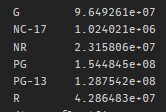
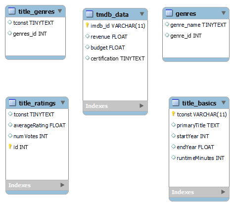

# IMDB recomendation
# Business Problem
For this project, you have been hired to produce a MySQL database on Movies from a subset of IMDB's publicly available dataset. Ultimately, you will use this database to analyze what makes a movie successful and will provide recommendations to the stakeholder on how to make a successful movie.
 
# Resources 
Use public IMDB/TMDB data to make a movie recomendation tool

## Citations

[THe Movie Data Base](https://www.themoviedb.org)

[Internet Movie Database](https://www.imdb.com/conditions)

# Specifications
The stakeholder only wants to include information for movies based on the following specifications:
- Exclude any movie with missing values for genre or runtime
- Include only full-length movies (titleType = "movie").
- Include only fictional movies (not from documentary genre)
- Include only movies that were released 2000 - 2021 (include 2000 and 2021)
- Include only movies that were released in the United States
- Use TMDB joined with IMDB to extract financial information.  Exclude movies with 0/NaN `budget` OR `revenue`

# Deliverables
- [x] Data/tmdb_results_combined.csv.gz - combined filter results per specifications 

# Exploratory Data Analysis
- [x] 1. How many movies had at least some valid financial information (values > 0 for budget OR revenue)?
 - 5534
 - [x] How many movies had complete financial information (values > 0 for budget AND revenue)?
  - 1810
  - **Exploratory Data Analysis performed on data with complete financials**
- [x] 2. How many movies are there in each of the certification categories (G/PG/PG-13/R)?
  
  

- [x] 3. What is the average revenue per certification category?
 
  
 
- [x] 4. What is the average budget per certification category?

  

- [x] What is the average ROI (Revenue - budget)?
 
  

# Creating MySQL Tables

